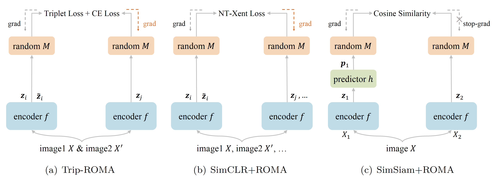

## Trip-ROMA: Self-Supervised Learning with Triplets and Random Mappings
This is a PyTorch implementation of the [Trip-ROMA paper](https://openreview.net/forum?id=MR4glug5GU).



### Dependencies

If you don't have python 3 environment:
```
conda create -n trip python=3.8
conda activate trip
```
Then install the required packages:
```
pip install -r requirements.txt
```

### Train

1. Config `CONFIG`, `DATA_DIR` and `LOG_DIR` in `script/train.sh` or `script/train_ddp.sh`. We use DDP for ImageNet and STL10 by default.
2. Run
    ```shell
    sh scripts/train.sh
    ```
    for single gpu training, or
    ```shell
    sh scripts/train_ddp.sh
    ```
    for DDP training.

### Test
1. Config `CONFIG`, `DATA_DIR` and `LOG_DIR` in `script/eval.sh`.
2. Run
    ```shell
    sh scripts/eval.sh
    ```

### Citation

```
@article{li2022triproma,
title={Trip-{ROMA}: Self-Supervised Learning with Triplets and Random Mappings},
author={Wenbin Li, Xuesong Yang, Meihao Kong, Lei Wang, Jing Huo, Yang Gao, Jiebo Luo},
journal={Transactions on Machine Learning Research},
year={2023}
}
```

### Acknowledgement
[PatrickHua/SimSiam](https://github.com/PatrickHua/SimSiam)
